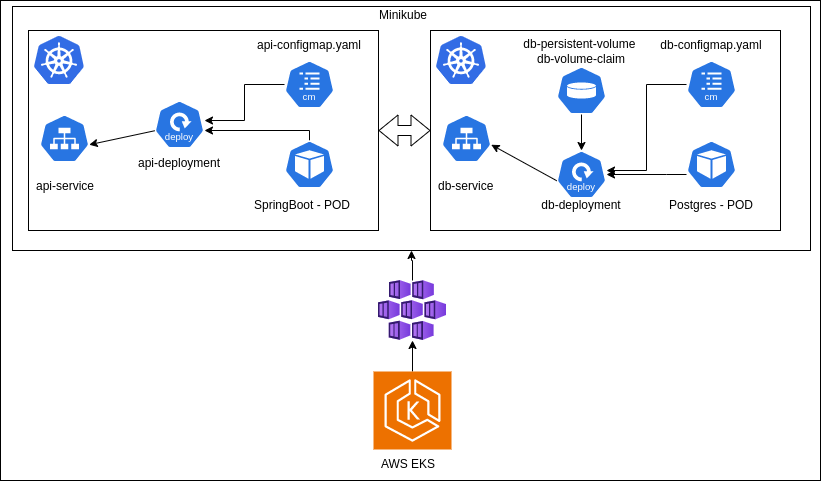
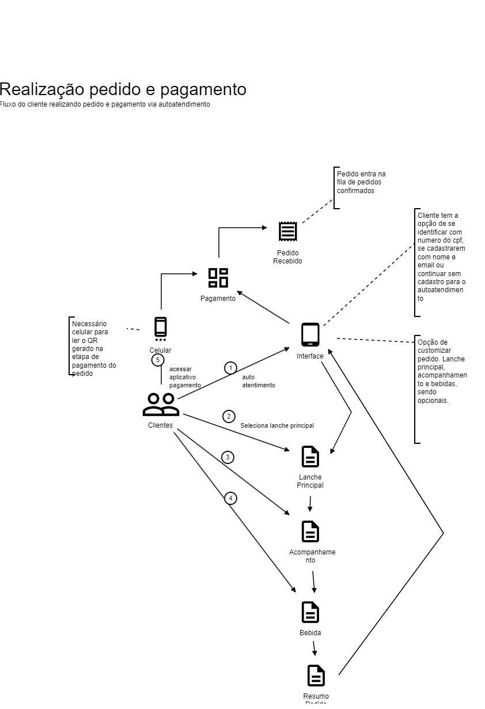
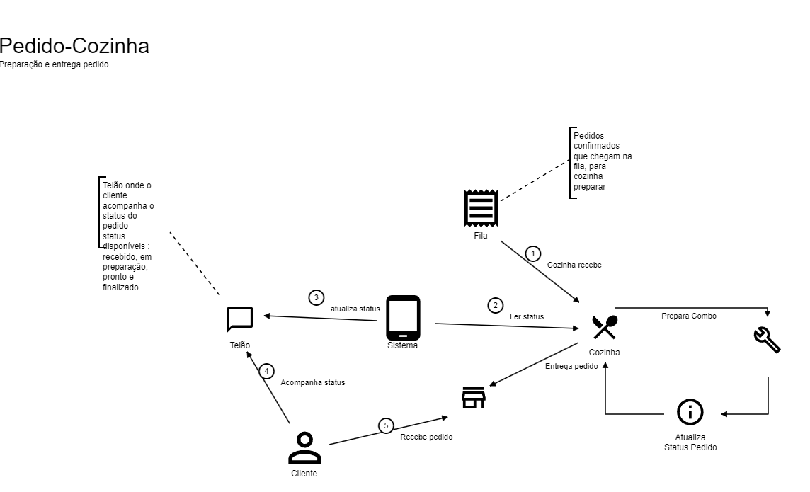

<h1 align="center">
  
  <br>
  Seven Food
</h1>

<p align="center">Simplifique sua experiência de pedidos em restaurantes com o nosso aplicativo de autoatendimento, projetado para oferecer conveniência e eficiência durante suas visitas.</p>

## 🍔 Facilidade de Pedidos

Aproveite a conveniência de fazer pedidos diretamente de um totem de autoatendimento. Nosso aplicativo permite que você selecione facilmente itens do menu, personalize suas escolhas e faça pedidos rapidamente, sem a necessidade de esperar na fila.

### Personalização Sob Demanda

Quer adicionar ou remover ingredientes de seu hambúrguer? Ou talvez prefira escolher o tipo de queijo ou o molho em seu sanduíche? Nosso aplicativo oferece opções de personalização para garantir que seu pedido seja preparado exatamente como você deseja.

## 💳 Pagamento Rápido e Seguro

Além de simplificar o processo de pedidos, nosso aplicativo oferece opções de pagamento rápidas e seguras. Pague com facilidade diretamente no totem de autoatendimento e evite a espera na fila do caixa.

## 📍 Localização Fácil

Localize facilmente o totem de atendimento mais próximo usando nosso aplicativo. Com apenas alguns toques, encontre o restaurante mais próximo de você e faça seu pedido antes mesmo de chegar.

## 🚀 Como Começar

1. Localize um totem de atendimento disponível em nosso restaurante.
2. Abra o aplicativo e selecione os itens desejados no menu.
3. Personalize seu pedido de acordo com suas preferências.
4. Realize o pagamento de forma rápida e segura diretamente no totem.
5. Aguarde a notificação para retirar seu pedido no balcão de retirada.

## 📧 Contato

Se você tiver alguma dúvida ou precisar de suporte, entre em contato conosco em:

- Email: seuemail@exemplo.com
- Website: www.seusite.com


## 🚀 Como Instalar e Executar

Siga estas etapas simples para instalar e executar o aplicativo em seu dispositivo:

### Pré-requisitos

Certifique-se de ter o seguinte configurado em seu sistema:

- Ambiente de desenvolvimento Java verssão 17 instalado
- Docker e Docker Compose instalados

## Stack utilizada

* Java 17
* Spring boot 3
*  Flyway
* Intellij
* PostGres 12 (PGAdmin)
* Docker && Docker Compose
* Nginx como reverse proxy
* Swagger (OpenAPI)
* Junit 5
* Mockito
* Maven
* Kubernetes

### 🛠️ Passos de Instalação

1. Faça um clone do repositório para o seu ambiente local usando o seguinte comando:
   ```sh
   git clone https://github.com/fiapg70/tech-challenge-fase-1.git

### Docker Compose

Utilize o comando `docker compose up -d` para "construir" (*build*) e subir o servidor local, expondo a porta 3000 em `localhost`. Além do container da `api` também subirá o serviço `db` com o banco de dados de desenvolvimento.

**IMPORTANTE:** Esta API está programada para ser acessada a partir de `http://localhost:9991/api` e o banco de dados utiliza a porta `5432`. Certifique-se de que não existam outros recursos ocupando as portas `5432` / `16543` e `9991` antes de subir o projeto.

Para derrubar o serviço, execute o comando `docker compose down`.


### Docker compose para produção

No docer compose da raiz do proejeto temos um docker compose para produção, ele sobe o banco de dados, a api e o nginx como reverse proxy.

isso é feito com o comando: `docker compose up -d` com isso terei a api rodando na porta 80 e o banco de dados na porta 5432.

Para derrubar o serviço, execute o comando `docker compose down`.

### Configurações

Para rodar o projeto deverá colocar as variaveis de ambiente:

DATABASE_PASSWORD=Postgres2019!;DATABASE_URL=jdbc:postgresql://localhost:5432/sevenfood;DATABASE_USERNAME=postgres

ou fazer um .env com essas configurações:

DATABASE_PASSWORD=Postgres2019! \
DATABASE_URL=jdbc:postgresql://localhost:5432/sevenfood \
DATABASE_USERNAME=postgres

### Rodando a aplicação sem IDE ou em VM ou EC2.

1. Faça na pasta principal rodar o docker, nele contém postgres a compilação do Dockerfile da API e ngnix commo nginx reverse proxy.
   ```sh
   docker-compose up -d

### Rodando a aplicação sem IDE com o Docker Hub.

1. O containar da API está hospedado no docker hub, com a seguinte URL (https://hub.docker.com/r/rogeriofontes/sevenfood-api). Para baixar a imagem e rodar o container, execute o seguinte comando:
   ```sh
   docker pull rogeriofontes/sevenfood-api:1.0.0

2. Para rodar o container, execute o seguinte comando:
   ```sh
   docker run -it -e DATABASE_PASSWORD=Postgres2019! \
    -e DATABASE_URL=jdbc:postgresql://<<IP do HOST>>:5432/sevenfood \
    -e DATABASE_USERNAME=postgres \
    -t rogeriofontes/sevenfood-api:1.0.0
   
### Rodando o banco de dados postgres no kubernetes Local.
## Infraestrutura baseada no Kubernetes:
- Desenho de arquitetura utilizando Kubernetes com Minikube e EKS:
  

# Na infra estrutra do Kubernetes (K8S) foram criada duas estruturas, primeira estrutura de um banco de dados PostgreSQL e outra para subir a API em Spring boot que conecta nesse banco através da infra do K8S.

# Na Infra do PostGres temos as seguintes configurações:

No arquivo de configuração db-persistent-volume.yaml e no arquito de configuação db-volume-claim.yaml foram usados para definir um storage de 8Gb para o banco).
No arquivo de configuração db-configmap.yaml, foi condigurados as variaves de ambiente com dados para serem usados pela imagem do banco de dados.
No arquivo de configuração db-deployment.yaml, foi defino os pods onde está o configmap, e a descrição das esturura de replicas e estrutura para execução do trabalho.
No arquivo de configuração db-service.yaml, foi utilizado para exposição do banco na porta 5432.

Comando para subir o banco como serviço no Kubernetes:
[Infra-DB](https://github.com/fiapg70/tech-challenge-fase-1/blob/feature/refactoring/infra/k8s/db/comandos.md)

# Na Infra da API (Spring boot) temos as seguintes configurações:

No arquivo de configuração api-configmap.yaml, foi configurados as variáves de ambientes, com dados para serem usados pela API para acessar o serviço do banco de dados.
No arquivo de configuração api-deployment.yaml, foi defino os pods onde está o configmap, e a descrição das esturura de replicas e estrutura para execução do trabalho da API do spring boot.
No arquivo de configuração api-svc.yaml, foi utilizado para exposição do api na porta 9991. No minikube, foi isado como tipo NodePort e no EKS foi usado tipo LoadBalancer;

Comando para subir o banco como serviço no Kubernetes:
[Infra-API](https://github.com/fiapg70/tech-challenge-fase-1/blob/feature/refactoring/infra/k8s/api/comandos.md)

[Minikube](https://github.com/fiapg70/tech-challenge-fase-1/blob/feature/refactoring/infra/k8s/videos/minikube.md)

# Na Infra também foi colocada no EKS:

Video no Minibuke:
[Minikube](https://github.com/fiapg70/tech-challenge-fase-1/blob/feature/refactoring/infra/k8s/videos/eks.md)

Para configuração da estrutura de um Cluster foi usado o AWS EKS, para isso foi feito uma infra em terraform para criar esse cluster:

[Infra Terraform](https://github.com/fiapg70/tech-challenge-fase-1/blob/feature/refactoring/infra/k8s/create-cluster-eks/comandos.md)

# Kubernetes Dashboard

e para melhorar a visualização foi criado o dashboard kubernetes.

[Kubernetes - Dashboard](https://github.com/fiapg70/tech-challenge-fase-1/blob/feature/refactoring/infra/k8s/dashboard/comandos.md)

### Endpoints

Esta API fornece documentação no padrão OpenAPI.
Os endpoints disponíveis, suas descrições e dados necessários para requisição podem ser consultados e testados em ```http://localhost:9991/api/swagger-ui/index.html```.

O repositório do projeto também fornece uma coleção do Postman para testes em todos os endpoints.

[Collection Postman](postman/sevenfood.postman_collection.json)

## Desenvolvimento do projeto

### Diagramas de fluxo

Definição dos fluxos:

- Realização do pedido e pagamento
  

- Preparação e entrega do pedido
  


### Desenvilmento dos códigos em inglës

O uso do inglês é para facilitar a leitura e entendimento do código, pois é uma linguagem universal de escrita de cõdigo-fonte. 


